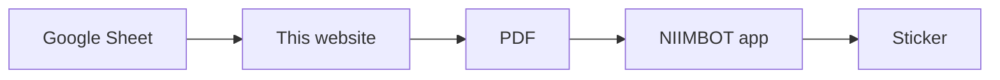

# Display Label Generator

A small website that makes **price stickers for display shoes**.

Website: **https://itmachino.github.io/display-label-generator/**

Each sticker shows the **shoe**, the **price** and a **barcode** of the SKU.

```text
┌───────────────────────┬──────────┐
│ Hana OG Flats         │          │  ← name: its own column on the left, max 2 lines
│ in White              │ RM 148.00│  ← price: its own column, at the bottom right
├───────────────────────┴──────────┤  ← line
│ ║▌║║▌▌║▌║║▌║▌║║▌║▌▌║║▌║▌║║▌║║▌   │  ← barcode
└──────────────────────────────────┘
   50 × 30 mm · NIIMBOT B1   (the dividing lines between name and price are not printed)
```

Name, price and barcode each have **their own area** and never mix.

- **Name:** starts at the top and fills line 1 first, never more than **2 lines**. When you change the
  name size, the words move between the lines by themselves:
  `Hana OG Flats / in White` → smaller → `Hana OG Flats in / White` → smaller → `Hana OG Flats in White`.
  A name that does not fit in 2 lines gets smaller by itself (down to 7pt); only a very long name gets its
  last words left off (yellow note).
- **Price:** always a little smaller than the name, at the bottom right (or top right).
- **Line and barcode:** in the same place on every sticker of a batch.

## Why the barcode matters most

The barcode is the shoe's **SKU from Shopify**, e.g. `1800044001-36`.

When staff scan it with the **Stock check** tile on the POS phone, they see the stock for every size.
If the SKU is wrong, the scan finds nothing. So the website checks every barcode before it prints.

## How it works



1. The **Google Sheet** lists every shoe design **once, with all its sizes**. Staff do not edit it to print.
2. Open the website on the phone. The list **loads by itself**.
3. **Search** or tap a **filter** (Heels, Flats, …), then **tap the sizes** you need. They go into the print list.
4. Tap **Print**: check the stickers, change copies, press **Download PDF**.
5. Open the PDF in the **NIIMBOT** app and print. Delete the extra **"Double-click to Edit"** box first.

The phone remembers the print list until you print. NEW SKUs (numbers) get a barcode, OLD SKUs (letters) get a QR code.

Print **one** sticker first, scan it with Stock check, then print the rest.

## The sheet

Row 1 must be:

| Column | What to type | Example |
|---|---|---|
| **SHOE** | Shoe name | Bliss Block Heels in Black |
| **PRICE** | Price in RM, numbers only | 178.20 |
| **SKU** | The SKU of **any one size**, exactly as in Shopify. The website swaps the size at the end for each sticker (`…-41` → `…-38`). | MA6025-2-B-20-41 |
| **SIZES** | All sizes, exactly as in Shopify (whole numbers). Commas and/or ranges. Empty = one sticker with the SKU as it is (e.g. a bag). | 34, 35-42 |

- Half sizes: type them as Shopify does (Shopify writes `34`, not `34.5`). `34.5` shows a red message.
- An old sheet with one row per sticker and no SIZES column still works: rows of the same shoe are put together.

The team sheet is built into the website, in `USUAL_SHEET_URL` in `index.html`, so it is always there.

- **To use another sheet on one computer:** paste its link in the box and press **Load**. That computer remembers it.
- **To go back:** press **Use the usual sheet**. **Clear** empties the box.
- **To change the sheet for everyone:** change `USUAL_SHEET_URL` and save to GitHub.

`sheet-template.csv` has the columns. A new sheet must be published: **File → Share → Publish to web**, as **CSV**.

## What is on the page

| Part | What it does |
|---|---|
| **Search** | Type part of a shoe name or SKU. The list filters as you type. |
| **Filter buttons** | All, Kids, Wedges, Mules, Sandals, Heels, Flats, Bags, Others (from the shoe name). **In my list** = shoes in the print list. **Check sheet** = rows with a red or yellow message. |
| **Shoe cards** | Name, price, SKU and a button for every size. Tap to add / remove. Red message = fix that row in the sheet (sizes cannot be picked). |
| **Bottom bar** | How many stickers are in the print list, and **Print ▸**. |
| **Print list** | Every sticker exactly as it prints, copies **− / +**, remove **✕**, **Code details** (bar width, QR square size, read-back check), **Download PDF**, the NIIMBOT steps. |
| **⚙ Settings** | Sheet link (**Load**, **Use the usual sheet**, open a CSV file), **Sticker design** (Standard / Code only; name, price and code options; **Reset to default**), **Try a sticker** (any name, price and SKU, not printed). Remembered on this phone. |

## What the website checks

| Check | If wrong |
|---|---|
| PRICE and SKU are filled in | Red: will not print |
| PRICE is a number (e.g. 208.00) | Red: will not print |
| SKU has only letters, numbers and "-", no spaces | Red: will not print |
| SIZES are whole numbers or ranges (`34, 35-42`) | Red: that shoe cannot be picked |
| The SKU ends with one of its SIZES | Yellow: shows what the stickers will say |
| The same shoe is not on two rows | Yellow: check which row is right |
| The barcode fits on the sticker (if not, a QR code is used instead) | – |
| The barcode reads back correctly (a barcode reader checks it) | Red: will not print |
| SHOE is empty | Yellow: prints with no name |
| SKU looks like one of our SKU styles (e.g. `1800044001-36`, `MF5022-3-05-39`, `MW-SK-F-1010-3-01-44`) | Yellow: prints, but check it |
| SKU has a letter O, I or l (maybe meant 0 or 1) | Yellow: prints, but check it |
| Shoe name long: printed small (under 8pt) to fit 2 lines | Yellow: prints, but check it is easy to read |
| Shoe name too long even small on 2 lines, last words left off | Yellow: prints, but shorten it in the sheet |
| Bars shorter than 10 mm | Yellow: prints, but check it |

## How the barcode is made (for IT)

- **Type:** Code 128, the same type as our other shoe labels. Every POS scanner and phone camera reads it.
- **Bar width:** the NIIMBOT B1 prints 8 dots per mm. Every bar is a whole number of dots: as wide as fits (4, 3 or at least 2 dots = 0.25 mm). Bars never get rounded thinner or thicker by the printer.
- **Quiet zone:** a blank space 10 bars wide at both ends, inside the part of the sticker the B1 prints.
- **Drawing:** bars are exact shapes in the PDF, not a picture, so they stay sharp.
- **Check:** before printing, each barcode is drawn at the printer's resolution and read back with a barcode reader (ZXing). It must give back the same SKU.
- **Long SKUs get a QR code.** A long SKU (e.g. `MA6021-14-EB-20-35`) makes a barcode wider than the 47 mm the B1 prints.
  Those stickers get a **QR code of the same SKU**, with the SKU written next to it. The POS camera (Stock check) reads QR codes too.
  Every QR square is a whole number of printer dots (3–6 dots), with a 4-square quiet zone, and each QR code is read back at
  every size it may print before it is allowed to print.

Built from two earlier tools: the [Photoshoot Label Generator](https://itmachino.github.io/label-generator/) (sheet loading, settings, checks) and the [david-lee-mac Label Generator](https://david-lee-mac.github.io/label-generator/) (templates, barcode measurements, drop-a-CSV).

## Files in this folder

| File | What it is |
|---|---|
| `README.md` | This page. Start here. |
| `index.html` | The whole website, in one file. |
| `sheet-template.csv` | The columns the Google Sheet must have (SHOE, PRICE, SKU, SIZES). |
| `test-data/test-stickers.csv` | 6 test stickers, for the print test. |
| `test-data/test-stickers.pdf` | Those 6 stickers, ready to print. |
| `test-data/bad-rows.csv` | Rows with mistakes, to check the website catches them. |
| `test-data/qr-stickers.csv` | 4 long SKUs (QR code) and 1 short SKU (barcode), for the QR print test. |
| `test-data/sizes-test.csv` | SIZES examples and mistakes (`34.5`, `abc`, SKU without size, a bag), to check the messages. |

**Test stickers are for testing only.** Their prices are examples. Do not put them on shoes.

## Print test (do this before using it for real)

Print `test-data/test-stickers.pdf`. Every sticker must pass all checks:

| # | SKU | Stock check shows the right shoe | POS Search scanner finds it | Phone camera reads it |
|---|---|---|---|---|
| 1 | 1800044001-36 | | | |
| 2 | 1800018003-35 | | | |
| 3 | 1800044001 | | | |
| 4 | 1800018003-42 | | | |
| 5 | 1800018003-40 | | | |
| 6 | 1800018003-41 | | | |

Pass = every box ticked, each scan works the first time.

## Changing the website

1. Edit `index.html`.
2. Open it in a browser. In ⚙ Settings, open `test-data/test-stickers.csv` (or `sizes-test.csv`).
3. Tap some sizes, tap **Print**, open **Code details**: every value shows ✓.
4. Save to GitHub:

   PowerShell (Windows)
   ```powershell
   git add .
   git commit -m "Short note of what changed"
   git push
   ```

The website updates by itself in about a minute.
