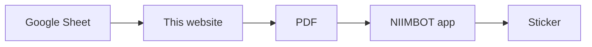

# Display Label Generator

A small website that makes **price stickers for display shoes**.

Each sticker shows the **shoe name and size**, the **colour**, the **price**, and a **barcode**.

```text
┌──────────────────────────────────┐
│ Lara Slingback Heels - 36        │
│ Hana White           RM 208.00   │
│ ║▌║║▌▌║▌║║▌║▌║║▌║▌▌║║▌║▌║║▌║║▌  │
│ ║▌║║▌▌║▌║║▌║▌║║▌║▌▌║║▌║▌║║▌║║▌  │
└──────────────────────────────────┘
   50 × 30 mm · NIIMBOT B1
```

## Why the barcode matters most

The barcode is the shoe's **Barcode / SKU from Shopify**, e.g. `1800044001-36`.

When staff scan it with the **Stock check** tile on the POS phone, they see the stock for every size.
If the barcode is wrong, the scan finds nothing. So the website checks every barcode before it prints.

## How it works



1. Staff type the shoes into the **Google Sheet** (one row per sticker).
2. Open the website. Press **Load**.
3. Look at the preview. Fix any row in **red** in the sheet, then press **Load** again.
4. Press **Download PDF**.
5. Open the PDF in the **NIIMBOT** app. Print at **100% size** (no "fit" or "scale").

Print **one** sticker first, scan it with Stock check, then print the rest.

## The sheet

Row 1 must have these columns:

| Column | What to type | Example |
|---|---|---|
| **Name** | Shoe name (needed) | Lara Slingback Heels |
| **Colour** | Colour | Hana White |
| **Size** | Size | 36 |
| **Price** | Price in RM, numbers only (needed) | 208.00 |
| **Barcode** | Barcode / SKU, exactly as in Shopify (needed) | 1800044001-36 |
| **Copies** | How many stickers (empty = 1) | 2 |

`sheet-template.csv` has these columns. In Google Sheets: **File → Import** it, then **File → Share → Publish to web** as **CSV**, and paste that link in the website.

## What the website checks

| Check | If wrong |
|---|---|
| Name, Price and Barcode are filled in | Red: will not print |
| Price is a number (e.g. 208.00) | Red: will not print |
| Barcode has only letters, numbers and "-", no spaces | Red: will not print |
| The size at the end of the barcode matches the Size column | Red: will not print |
| The same barcode has the same name and price on every row | Red: will not print |
| The barcode fits on the sticker | Red: will not print |
| The barcode reads back correctly (a barcode reader checks it) | Red: will not print |
| Barcode looks like our usual code (10 numbers, "-", size) | Yellow: prints, but check it |
| Barcode has a letter O, I or l (maybe meant 0 or 1) | Yellow: prints, but check it |
| Name or colour too long, some words left off | Yellow: prints, but check it |

## How the barcode is made (for IT)

- **Type:** Code 128, the same type as our other shoe labels. Every POS scanner and phone camera can read it.
- **Bar width:** the NIIMBOT B1 prints 8 dots per mm. Every bar is a whole number of dots: 3 dots (0.375 mm) if the code fits, otherwise 2 dots (0.25 mm). Bars never get rounded thinner or thicker by the printer.
- **Quiet zone:** a blank space 10 bars wide at both ends, inside the part of the sticker the B1 can print.
- **Drawing:** bars are drawn as exact shapes in the PDF, not as a picture, so they stay sharp.
- **Check:** before printing, each barcode is drawn at the printer's resolution and read back with a barcode reader (ZXing). It must give back the same code.
- **No text under the barcode.** This keeps the bars tall and easy to scan.

## Files in this folder

| File | What it is |
|---|---|
| `README.md` | This page. Start here. |
| `index.html` | The whole website, in one file. |
| `sheet-template.csv` | The columns the Google Sheet must have. |
| `test-data/test-stickers.csv` | 6 test stickers, for the print test. |
| `test-data/bad-rows.csv` | Rows with mistakes, to check the website catches them. |

**Test stickers are for testing only.** Their prices are examples. Do not put them on shoes.

## Print test (do this before using it for real)

Print `test-data/test-stickers.csv`. Every sticker must pass all checks:

| # | Barcode | Stock check shows the right shoe | POS Search scanner finds it | Phone camera reads it |
|---|---|---|---|---|
| 1 | 1800044001-36 | | | |
| 2 | 1800018003-35 | | | |
| 3 | 1800044001 | | | |
| 4 | 1800018003-42 | | | |
| 5 | 1800018003-40 | | | |
| 6 | 1800018003-41 | | | |

Pass = every box ticked, each scan works the first time.

## Changing the website

1. Edit `index.html`.
2. Open it in a browser. Use **Or open a CSV file** with `test-data/test-stickers.csv`.
3. Check the stickers still say "✓ Barcode checked".
4. Save to GitHub. The website updates by itself in about a minute.

When the team sheet exists, put its published link in `USUAL_SHEET_URL` in `index.html`, so it loads for everyone.

Made from the [Photoshoot Label Generator](https://itmachino.github.io/label-generator/).
